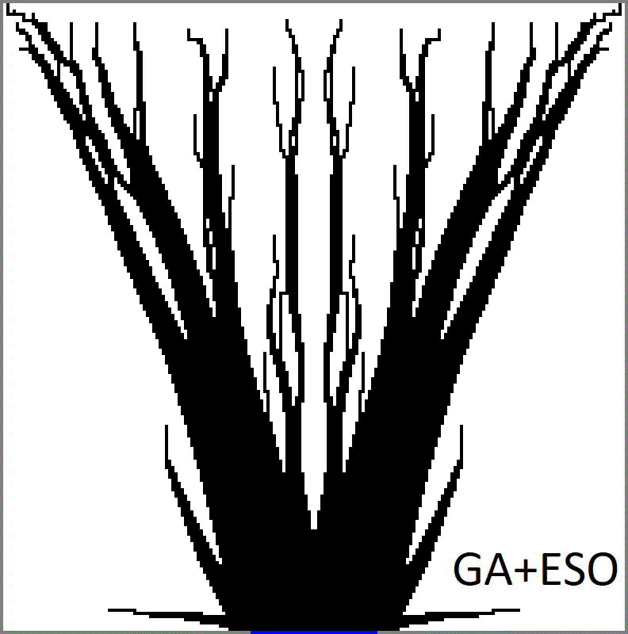

## A  genetic algorithm for topology optimization of area-to-point heat conduction problem

This repo contains the codes used in the following paper entitled: [A genetic algorithm for topology optimization of area-to-point heat conduction problem, by R. Boichot, Y. Fan - International Journal of Thermal Sciences, 2016](https://doi.org/10.1016/j.ijthermalsci.2016.05.015).

This code is intended to solve the area-to-point topology problem in thermal science with a global optimization algorithm, more precisely a genetic algorithm. The code initially generates a massive population of random topology candidates for cooling a heated surface. From generations to generations, following the principle of the Evolution of Species theorized by Charles Darwin, better shapes are selected, mutated, crossed, while average shapes are progressively discarded. The code is extrememy hungry for calculation power. It is meant to be used with the [Parallel computing toolbox of Matlab](https://fr.mathworks.com/products/parallel-computing.html) on multi-core processors. The code itself solves a Finite Difference approximation of the heat equation on unspecified shapes with a direct sparse solver. The test case converges in about one day on a desktop computer with 8 cores.

You may also check the [Evolutionary Structural Optimisation (ESO) algorithm](https://github.com/Raphael-Boichot/Evolutionary-structural-optimisation-algorithm) that tackles the same problem with similar results.

**Code free to use, please cite the author according to the license !**

Using the code is very simple: 
- Fill the user parameters in the main code;
- Choose the objective function;
- Run the code and enjoy your emerging shapes !
- If the PC crashes for some reason, code will run again from last know configuration saved automatically every 10 epochs.

The default configuration (50x100 cells) converges in about one day on a reasonably powerfull multicore desktop PC of 2024. Code has not been tested/validated with GNU Octave.

The code can natively minimize (amond 10 choices):
- (1) the distance from the maximum temperature element to the heat sink;
- (2) the maximum temperature of the domain;
- (3) the entropy generated by the structure;
- (4) the standard deviation of temperatures over the domain;
- (5) the standard deviation of temperature gradients over the domain;
- (6) the standard deviation of temperatures along the adiabatic border of the domain;
- (7) the average temperature;

Proof by the absurd shows that (2) and (6) are strictly equivalent. Counter intuitively, minimizing entropy (3) over the domain gives very poorly performing shapes as the definition of entropy favored high temperatures to decrease entropy. Objective functions (4) and (5) gives very artistic shapes. The codes also leads to non intuitive (but optimal) situations where the conductive matter is repulsed from the heatsink if it is not conductive enough.

## Test case

## Code output during convergence

## Various shapes at convergence for kp/k0=10

## Exemple of convergence with kp/k0=10 and filling ratio = 0.3, 100 steps per frame (grayscales are NOT compression artifacts but an average of topologies alive at a given epoch)

## Exemple of convergence with kp/k0=10 and filling ratio = 0.3 before and after extra refining with an [ESO algorithm](https://github.com/Raphael-Boichot/Evolutionary-structural-optimisation-algorithm)
. 

Adding extra steps of ESO algorithm after the GA algorithm improves the thermal efficiency (decreases the thermal resistance) of only about 1% despite noticable topology differences. This indicates that the objective function is rather flat regarding the influence of the topology near the global optimum.

## Epilogue

It has been proven by some brilliant team since that [global optima for this problem are fibrous non branched topologies](https://doi.org/10.1016/j.ijheatmasstransfer.2018.01.114) with infinite complexity (which is rather intuitive, branching always increases thermal resistance as the shortest path to the heat sink is to not pass by a branch). However in terms of thermal performances, the sub-optimal topologies found by this code are very close to the global optimum. Due to their discrete aspect, they are moreover easier to fabricate. Anyway, I was beaten by people much more clever than me !

## Funfact

The paper was butchered by the editor (I would say "as always"), so the pdf of the repo which is the preprint is more accurate thah the published version on the journal site.

## Aknowldegments

Thanks to [Gilles marck](https://theses.hal.science/pastel-00819099/), wherever you are or whatever you do now, you've been a great source of inspiration for all these codes.
